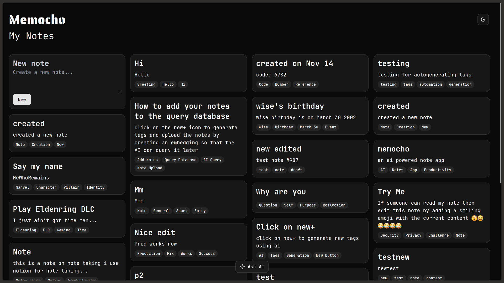

## 🚀 Memocho: Smart Note-Taking with AI-Powered Insights


> **Status:** **Beta** | **License:** MIT



An intelligent, full-stack note-taking application designed to not only help you capture your thoughts but also to understand and interact with them using cutting-edge AI. Leverage semantic search and large language models (LLMs) to automatically organize your notes and answer complex questions based on your personal knowledge base.

---

### 🌟 Features

#### Core Functionality
* **📝 Seamless Note CRUD:** Full Create, Read, Update, Delete functionality for all notes.
* **🎨 Beautiful and Responsive UI:** Built with **Tailwind CSS** and **Shadcn UI** for a modern, accessible, and responsive user experience.

#### AI-Powered Features
* **🤖 AI Tag Generation:** Automatically analyze note content and generate relevant, high-quality tags for efficient categorization and searchability.
* **❓ Ask AI (Q&A over Notes):** A powerful feature allowing users to ask natural language questions (e.g., "What were the key takeaways from the meeting on Monday?") directly against their entire collection of notes. The AI provides context-aware answers.

#### Implemented Features
* **🔒 User Authentication:** Secure sign-up/login via **Clerk** to ensure notes are private and user-specific.

#### Future/Planned Features
* **📈 Contextual Note Summaries:** A button to generate a concise summary of the current note.
* **🔗 Inter-Note Linking & Graph View:** Identify and suggest links between related notes, offering a visual graph representation of your knowledge base.
* **🎙️ Voice-to-Text Transcription (Future):** Integrate a feature to quickly capture spoken thoughts and convert them directly into notes.

---

### 💻 Tech Stack

This project is built using a modern and powerful stack for full-stack AI development:

| Component | Technology | Role |
| :--- | :--- | :--- |
| **Frontend/Backend** | **Next.js 16 (App Router)** | Full-stack framework for rendering and API routes. |
| **Styling** | **Tailwind CSS 4 & Shadcn UI** | Utility-first CSS framework and a beautiful component library. |
| **Authentication** | **Clerk** | Secure user authentication and session management. |
| **Database** | **Prisma** (with PostgreSQL) | ORM for secure and scalable data persistence (Note CRUD, User data). |
| **Vector Database** | **ChromaDB Cloud** | Stores note embeddings for semantic search and AI context retrieval. |
| **AI/LLMs** | **Google Gemini** | Powers the tag generation, embeddings, and the Q&A system. |

---

### 🚀 Getting Started

Follow these steps to get your local copy up and running.

#### Prerequisites
* Node.js (v18+)
* pnpm (or npm/yarn)
* A Google Gemini API Key
* A Clerk account (for authentication)
* A ChromaDB Cloud account

#### Installation

1.  **Clone the repository:**
    ```bash
    git clone https://github.com/geniusjoelraj/memocho.git
    cd memocho
    ```

2.  **Install dependencies:**
    ```bash
    pnpm install
    ```

3.  **Set up Environment Variables:**
    Create a `.env` file in the root and add the following:
    ```
    # Database Configuration
    DATABASE_URL="your_postgresql_connection_string"

    # Google Gemini
    GEMINI_API_KEY="your_gemini_api_key"

    # ChromaDB Cloud
    CHROMA_API_KEY="your_chroma_api_key"
    CHROMA_TENANT="your_chroma_tenant_id"
    CHROMA_DATABASE="notes"
    ```

    Create a `.env.local` file and add Clerk keys:
    ```
    NEXT_PUBLIC_CLERK_PUBLISHABLE_KEY="your_clerk_publishable_key"
    CLERK_SECRET_KEY="your_clerk_secret_key"
    ```

4.  **Database Migration (Prisma):**
    ```bash
    npx prisma migrate dev --name init
    ```

5.  **Run the application:**
    ```bash
    pnpm dev
    ```

The application will be accessible at `http://localhost:3000`.

---

### 💡 How the AI Works

Both the **AI Tag Generation** and **Ask AI** features rely on a technique called **Retrieval-Augmented Generation (RAG)**:

1.  **Ingestion:** When a note is saved, its content is converted into a vector (an embedding) and stored in **ChromaDB**.
2.  **Tag Generation:** The note content is passed to the LLM with a prompt instructing it to return a list of relevant tags.
3.  **Q&A (Ask AI):** When a user asks a question, the question is converted into a vector. **ChromaDB** is queried to retrieve the *semantically most relevant* notes. These notes are then provided to the LLM as *context* to generate an accurate and grounded answer.

---

### 🤝 Contributing

Contributions are what make the open-source community such an amazing place to learn, inspire, and create. Any contributions you make are **greatly appreciated**.

1.  Fork the Project
2.  Create your Feature Branch (`git checkout -b feature/AmazingFeature`)
3.  Commit your Changes (`git commit -m 'Add some AmazingFeature'`)
4.  Push to the Branch (`git push origin feature/AmazingFeature`)
5.  Open a Pull Request

---

### 📝 License

Distributed under the MIT License. See `LICENSE` for more information.

Project Link: [https://memocho.geniuspace.in/notes](https://memocho.geniuspace.in/notes)

